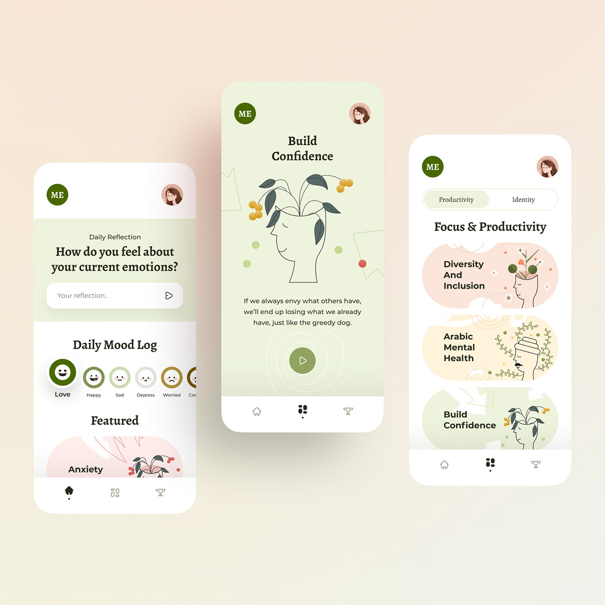
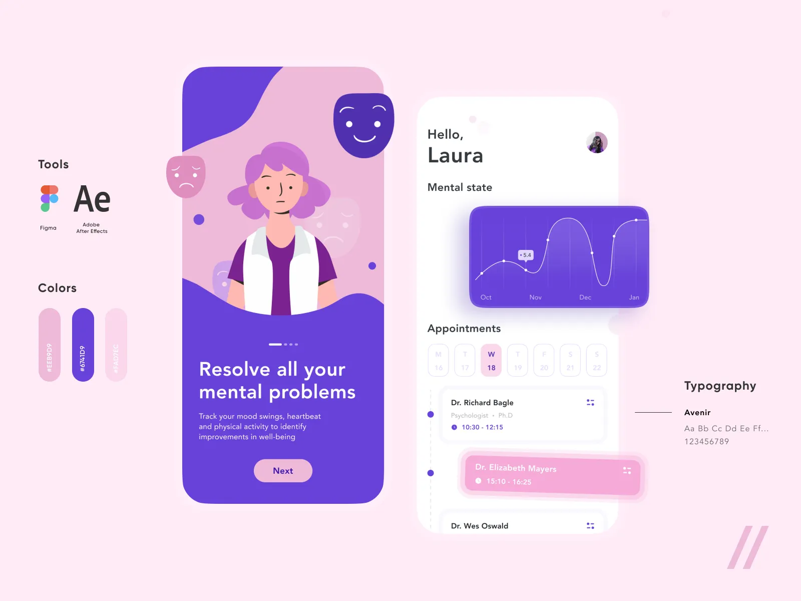

# MindSpace

## A platform that simulates a mental health consultation and self-reflection.

## Website link: [triek.github.io/mind-space](https://triek.github.io/mind-space)

The goal is not therapy, not diagnosis, and definitely not saving the world.
The goal is to practice building a calm, structured UI for sensitive topics like stress, anxiety, and self-reflection.

Everything runs in the browser using mock data and localStorage.

**What this app does:**

- Lets users write about what’s bothering them in consultation-style threads

- Provides guided prompts to help users express thoughts more clearly

- Includes simple mental health check-ins (PHQ-9, GAD-7 style quizzes)

- Shows progress over time using basic charts

- Offers a small, curated resource library

- Always keeps a visible safety/help page

No real counseling. No real AI. No backend. This is a UX and structure exercise.

**Tech snapshot:**

- Frontend: Vue 3 + TypeScript + Tailwind  
- Backend: Node.js + Express  
- Databases: MongoDB + Postgres

**Project status:**

This is an early MVP built for learning and portfolio purposes.
Future versions may add backend services, authentication, and AI features.

Right now, the focus is simple, usable, and finished.

https://www.bing.com/images/search?view=detailV2&ccid=UaXBI7pu&id=5B47A189112D46ACC88737FB17830714ADFA3C0A&thid=OIP.UaXBI7puqC1pLmw8AAiMYgHaHa&mediaurl=https%3A%2F%2Fmir-s3-cdn-cf.behance.net%2Fproject_modules%2F1400%2F2aa335169617067.645012a17174a.jpg&exph=1400&expw=1400&q=ui+design+mental+health+app&FORM=IRPRST&ck=189DAAC9F35B86EA639A4B8CF73424C3&selectedIndex=0&itb=0&cw=855&ch=851&ajaxhist=0&ajaxserp=0

https://www.bing.com/images/search?view=detailV2&ccid=fnbLv3fo&id=3F13C5EACA3C905B0A9F2111BDBD9C11693F44D6&thid=OIP.fnbLv3foFirg_81ICHZmJwHaFj&mediaurl=https%3A%2F%2Fi.pinimg.com%2Foriginals%2F0f%2Fba%2F0f%2F0fba0fd3ecbd2670f8768e92481b597c.png&exph=750&expw=1000&q=professional+ui+design&FORM=IRPRST&ck=37AAA886B3A936EAC1A54ABB3A9F99C4&selectedIndex=5&itb=0&cw=855&ch=851&ajaxhist=0&ajaxserp=0

https://www.bing.com/images/search?view=detailV2&ccid=k2zrd%2BRa&id=A050540222C4D44D2828444F0101DF7D69C1F1CE&thid=OIP.k2zrd-RaEMVoB621oJbr-AHaHa&mediaurl=https%3A%2F%2Fimg.freepik.com%2Fpremium-photo%2Fui-ux-designs_1197721-38061.jpg&exph=626&expw=626&q=ui+design&form=IRPRST&ck=F3E65674F1D3A8394C5399BDDC642C82&selectedindex=9&itb=0&cw=855&ch=851&ajaxhist=0&ajaxserp=0&pivotparams=insightsToken%3Dccid_iluTdY%252F2*cp_8BFD082316AAF36ADEA6E2E4DF1AEBA4*mid_9128C80D23453A1F1FD03A77185947D702025468*thid_OIP.iluTdY!_2!_!_GZp40TTBfG!_AHaFH&vt=0&sim=11&iss=VSI